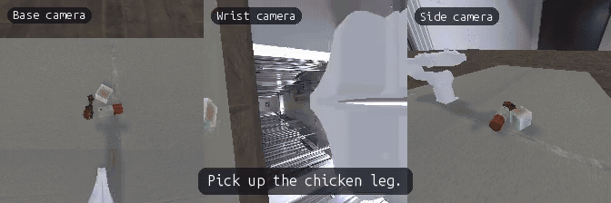

# PIPER Lift Task Examples

This directory contains PIPER-specific motion-planning examples for two lift
tasks introduced by this extension. The examples are kept next to their
implementations and are not part of ManiSkill's maintained tutorial index.

| Environment | Objective |
| --- | --- |
| `LiftCubePiper-v1` | Grasp the red cube and lift it by 10 cm for three control steps. |
| `LiftAnythingPiper-v1` | Grasp a cube, YCB object, or InternData object and satisfy the same lift condition. |

Both environments use the `piper_wristcam` robot, `pd_joint_pos` control, and
three 224 x 224 RGB cameras:

```text
base_camera | wrist_camera | side_camera
```

## LiftAnything example

This expert episode lifts an InternData chicken-leg target among two InternData
distractors. Lighting, table texture, and clutter placement are randomized
during the episode, and the synchronized triptych keeps the object-specific
task prompt visible.



## Quick start

The launcher creates and manages a Python 3.11 environment with
[uv](https://docs.astral.sh/uv/). Run it from the repository root on a machine
with a Vulkan-capable GPU:

```bash
./scripts/run_piper_lift_tasks.sh
```

On its first run, the launcher creates a machine-local virtual environment and
installs `requirements-lift.txt`. It then runs one MPLib expert episode for each
task. `LiftAnythingPiper-v1` uses a procedural cube by default, so this first
run does not require additional object assets.

The launcher exits with a non-zero status if environment creation, camera
validation, motion planning, or the task itself fails.

## Run one task

Run only the fixed-cube task:

```bash
./scripts/run_piper_lift_tasks.sh --task liftcube --seed 42
```

Run only the object-generalized task:

```bash
./scripts/run_piper_lift_tasks.sh --task liftanything --seed 42
```

To reset the environments and validate their camera observations without
running motion planning:

```bash
./scripts/run_piper_lift_tasks.sh --mode reset
```

## Record videos

Expert runs record a synchronized three-camera video by default. Each frame is
a labeled horizontal triptych in this order:

```text
base_camera | wrist_camera | side_camera
```

Each camera panel is 224 x 224, so the final frame remains 672 x 224 at 20 FPS.
Small translucent badges identify the cameras, while the task prompt floats
over the bottom of the frame without adding a separate bar. Long prompts wrap
inside the frame. The final JSON summary printed by the launcher contains the
exact paths in `video_files` and the effective `task_prompt`.

The built-in prompt is `Pick up the red cube.` for LiftCube. LiftAnything
derives an object-specific prompt from the sampled target, for example
`Pick up the chicken leg.` or `Pick up the cracker box.` Override the displayed
prompt explicitly when desired:

```bash
./scripts/run_piper_lift_tasks.sh \
  --task liftanything \
  --task-prompt "Pick up the target object without touching the distractors."
```

Use the external render camera instead:

```bash
./scripts/run_piper_lift_tasks.sh --video-view third-person
```

Select another output directory or disable video recording:

```bash
./scripts/run_piper_lift_tasks.sh --video-dir /path/to/videos
./scripts/run_piper_lift_tasks.sh --no-video
```

`--mode reset` does not record a trajectory video because it does not execute
actions.

## Select LiftAnything objects

The default object source is `cube`. YCB and InternData sources can be selected
explicitly when their assets are available:

```bash
./scripts/run_piper_lift_tasks.sh \
  --task liftanything \
  --object-source ycb \
  --seed 42
```

InternData is a gated Hugging Face dataset and requires accepted access and
authentication.

A previously materialized `EpisodeSpec` can reproduce a particular episode:

```bash
./scripts/run_piper_lift_tasks.sh \
  --task liftanything \
  --episode-spec /path/to/episode_specs.json \
  --episode-index 0
```

`--episode-spec` and `--object-source` are mutually exclusive.

## Clutter and mid-episode randomization

`LiftAnythingPiper-v1` accepts the same clutter contract as
`PickAnything-v1`. A fixed value creates that many physical distractors in
every environment:

```bash
./scripts/run_piper_lift_tasks.sh \
  --task liftanything \
  --clutter 3
```

By default, distractors reuse the target object's source pool. Configure them
independently with `--clutter-sources`. This keeps the target as a simple cube
while making the distractors visually recognizable InternData objects:

```bash
./scripts/run_piper_lift_tasks.sh \
  --task liftanything \
  --object-source cube \
  --clutter 2 \
  --clutter-sources interndata
```

Multiple clutter sources may be mixed, for example
`--clutter-sources ycb interndata`. InternData is gated and downloads sampled
meshes on demand.

A range draws a new active count independently for each environment and
episode. The upper bound is built once, and inactive distractors are moved out
of the workspace:

```bash
./scripts/run_piper_lift_tasks.sh \
  --task liftanything \
  --clutter random_2_5
```

By default, the environment invokes its mid-episode randomizers every 25
control steps. Select any subset of the `lighting`, `table`, and `clutter`
axes, or set the frequency to zero to disable mid-episode changes:

```bash
./scripts/run_piper_lift_tasks.sh \
  --task liftanything \
  --clutter random_2_5 \
  --table-randomizer procedural \
  --domain-rand-freq 25 \
  --domain-rand-axes lighting table clutter

./scripts/run_piper_lift_tasks.sh \
  --task liftanything \
  --domain-rand-freq 0
```

The fixed `wood` table has no alternative material to resample. Choose
`procedural` for a no-download changing PBR material or `texture` for changing
InternData surface textures. Table material and directional lighting are
global in a GPU single-scene setup; target objects and clutter remain
per-environment.

## Parallel environments

The environment supports `num_envs > 1` for batched reset/step and RL. The
one-command launcher exposes a reset-only camera check:

```bash
./scripts/run_piper_lift_tasks.sh \
  --task liftanything \
  --mode reset \
  --num-envs 8 \
  --clutter random_2_5 \
  --table-randomizer procedural
```

For stepping parallel environments, use the generic demo or an RL entry point:

```bash
python -m mani_skill.examples.demo_random_action \
  -e LiftAnythingPiper-v1 \
  --num-envs 8 \
  --sim-backend gpu \
  --object-sources cube \
  --table-randomizer procedural \
  --floor-randomizer grid \
  --clutter random_2_5 \
  --clutter-sources interndata \
  --domain-rand-freq 25 \
  --domain-rand-axes lighting table clutter
```

The MPLib expert, video recorder, trajectory collector, and full
`EpisodeSpec` replay remain single-environment workflows. A fixed `ObjectSpec`
can be replicated across parallel environments; each environment still gets
its own randomized pose and robot initial state.

## Experimental antipodal expert benchmark

The default user-facing expert remains the legacy OBB implementation. The
antipodal implementation is opt-in and is evaluated against an OBB provider
using the same collision-aware pipeline:

```text
L0 = OBB + legacy pipeline (regression reference)
A  = OBB + common collision-aware pipeline
B  = antipodal + common collision-aware pipeline
```

First materialize deterministic episodes with post-settle state, then provide
an object-category JSON mapping each stable object ID to one of
`simple_convex`, `thin_flat`, `ring_u_concave`, or `multipart_slender`.
Freeze a 24-object pilot with six objects per category:

```bash
uv run python scripts/freeze_lift_anything_benchmark.py \
  --episode-manifest /path/to/materialized.json \
  --category-map /path/to/categories.json \
  --output /path/to/pilot.json \
  --split pilot \
  --poses-per-object 5
```

Generate the reusable 256-candidate object-local cache and run the resumable
paired benchmark. Each episode result is written separately before aggregation,
so an interrupted worker can continue without losing completed shards:

```bash
uv run python scripts/generate_lift_anything_grasp_cache.py \
  --object-manifest /path/to/objects.json \
  --cache-dir /path/to/grasp-cache \
  --output-manifest /path/to/grasp-cache-manifest.json \
  --num-procs 32

uv run python scripts/run_lift_anything_grasp_benchmark.py \
  --benchmark-manifest /path/to/pilot.json \
  --grasp-cache-dir /path/to/grasp-cache \
  --output-dir /path/to/pilot-results \
  --groups L0,A,B \
  --num-procs 32 \
  --render-backends cuda:0
```

After pilot tuning, freeze the formal set with `--split formal` and
`--exclude-manifest /path/to/pilot.json`. The formal manifest records hashes
for the frame convention, geometry preprocessing, sampler configuration, and
collision proxy. The report uses object-level paired bootstrap and only marks
Antipodal promotable when its robust success improves by at least ten
percentage points, the 95% confidence interval is above zero, and the simple
convex control interval remains above -2 percentage points.
The end-to-end runner reports gripper-only oracle recall as `not_run`/`null`;
populate that metric only from a separate physics-oracle sweep instead of
inferring it from arm IK or execution outcomes.

## Runtime options

Select a different GPU renderer:

```bash
./scripts/run_piper_lift_tasks.sh --render-backend cuda:1
```

Choose a persistent virtual-environment location if the default temporary
location is unsuitable:

```bash
MANISKILL_LIFT_VENV=/path/to/.venv ./scripts/run_piper_lift_tasks.sh
```

Show every supported option:

```bash
./scripts/run_piper_lift_tasks.sh --help
```

## Implementation entry points

- `solutions/lift_cube.py`: adaptive grasp pose and fixed-cube expert.
- `solutions/lift_anything.py`: legacy OBB expert plus opt-in common OBB and
  antipodal pipelines.
- `grasping/`: geometry resolution, antipodal proposals, cache, collision
  checks, oracle contracts, and benchmark analysis.
- `motionplanner.py`: PIPER-specific MPLib planning and trajectory execution.
- `scripts/run_piper_lift_tasks.py`: environment validation, expert dispatch,
  and video recording.
- `scripts/collect_lift_cube_piper.py`: LiftCube trajectory collection.
- `scripts/collect_lift_anything_piper.py`: LiftAnything trajectory collection.
- `scripts/generate_lift_anything_grasp_cache.py`: parallel object-local cache
  generation.
- `scripts/freeze_lift_anything_benchmark.py`: stratified pilot/formal manifest
  freezing.
- `scripts/run_lift_anything_grasp_benchmark.py`: resumable L0/A/B execution and
  paired analysis.
